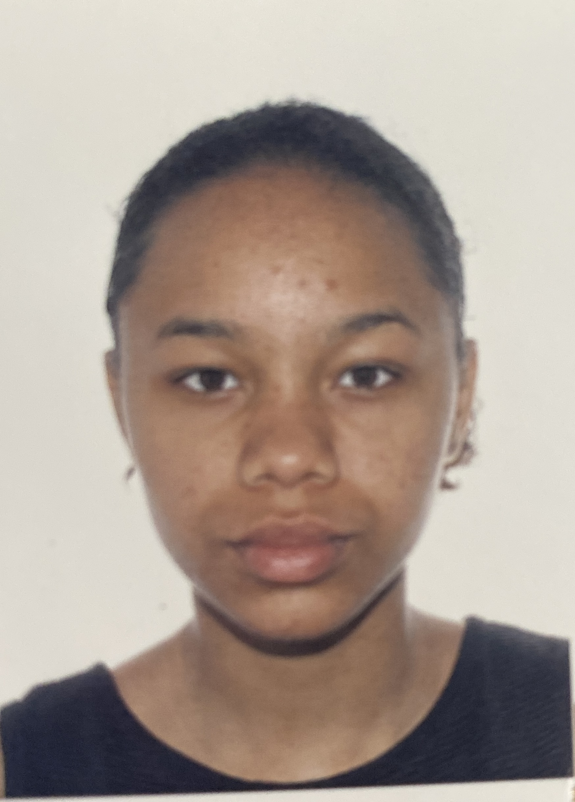

# markdown-challenge
# H1 TARA MARIE

*“If people are doubting how far you can go, go so far that you can’t hear them anymore.” —Michele Ruiz*

# H2 "Me, in one sentence"

- [ ]| Birthday: 08/07 | Favorite color: Black |
- [ ]| Favorite food: Briany | Pinneapple on pizza: No |
- [ ]| # H2 K-pop dance | - [x] Dance cover Love Shot Exo
- [x] Dance cover Shot Down BlackPink - [x] Dance cover Tomboy Gi-dle |
- [ ]| # H3 You can always count on me when you need someone to express yourself and you want to have more motivation| 
- [ ]| My positive energy can help the group to stay happy and concentrate all day | 
- [ ]| This could be technical, making people feel comfortable, being an organiser this is for why I would do my best every day ! |
- [ ] | One time a search all day my phone because I was scared of my mom find out it. Finaly, I call her tot tell the true and guess what? I CALL HER !!!  | 
- [ ] | # H3 TL;DR |
- [ ] | I'm so dump |

<< previous(https://github.com/LRI-2020/markdown-challenge/)  || TARA MARIE || next(https://github.com/AlexandreVDW/markdown-challenge) >>

